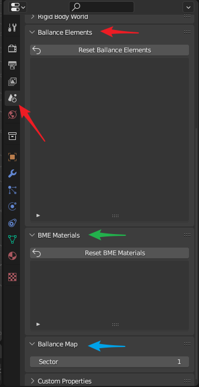

# Ballance Properties

The Ballance attributes are distinct from the Virtools attributes, which are a set of attributes dedicated to Ballance mapping. These properties are hosted in the scene and do not change within the same scene (mapping does not involve scene switching in Blender). The panels related to the Ballance property can be found in the `Scene` properties panel, as shown below, and they are:

* `Ballance Elements` panel (red arrows), corresponding to Ballance elements
* `BME Materials` panel (green arrow), corresponds to BME materials.
* `Ballance Map` panel (blue arrow), which corresponds to the Ballance map information.

Among these, only the Ballance Map information is the one you need to focus on, the other attributes are not normally of interest, except in the case of errors in some of the materials or meshes in the map.

## Ballance Map Information

Ballance Map infomation currently has only one option, Sector (map sector count). This attribute indicates the final desired number of sectors for the current map. This attribute is mainly used to work around the bug of exporting map, see the [Import and Export Virtools Document](./import-export-virtools.md) section for details on the bug.

The only thing you need to do is to check if this field is the number of sectors you expect before exporting the final map. Note that although you can set this field at the beginning of creating your map, there are other features in BBP that may modify this field, such as adding elements, importing Virtools documents, etc. For example, if you have a map with sector 3 specified and you are adding an element that belongs to sector 4, this value will automatically increase to 4. Similarly, when importing a Ballance map with a total of 4 sectors, this value will also increase to 4 (if the previous value was less than 4). The main reason for doing this is so that users can use this plugin without perceiving this value, especially when making slight modifications to some existing maps. Doing so, however, may not meet the user's needs in some cases, so it is still recommended that you check this field before exporting.

## Ballance Elements

Ballance Elements keep a record of the meshes of all the elements you have added using the BBP Add Elements feature. Meshes generally take up the largest amount of data in a 3D file, so reducing the number of meshes, i.e. by sharing meshes between objects of the same shape, can drastically reduce the size of the map file. When you use BBP to add an element-related function, it will first try to get the element's mesh from here, and if there is no corresponding mesh, it will be loaded and recorded here.

This panel is for viewing only, not editing. If you have accidentally modified the meshes of a BBP-added element (which should not have been modified in the first place) and want to restore its original shape, just click `Reset Ballance Elements` to reset all the element meshes in the list to their correct state.

## BME Materials

Similar to the Ballance Elements, records the materials used when adding floor using BME. This is also designed so that materials can be reused, so that you don't need to create a set of materials associated with each object you create, greatly reducing the number of duplicate materials.

This panel is for viewing only, not editing. When you accidentally modify BME related materials (which should not have been modified) and want to restore them, just click `Reset BME Materials` to reset all materials in the list to their correct state.