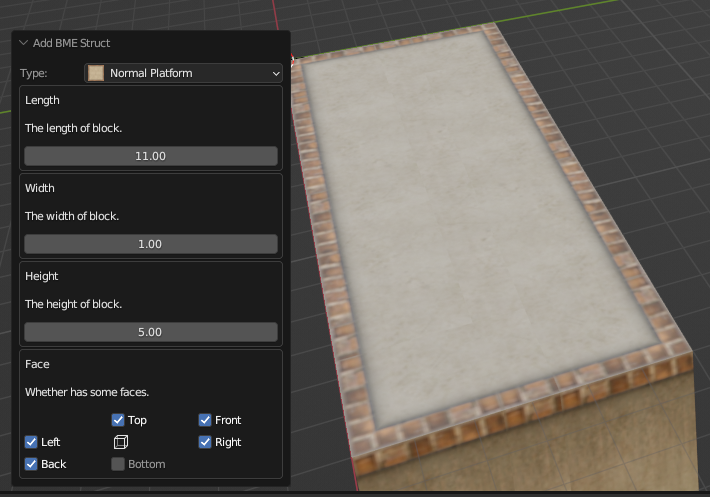

# Add Floor

!!! info "BME is extensible"
    BME's floor adder is extensible, each item in the menu is actually described by a set of JSON data. You can read the [Technical Information](./tech-infos.md) section to learn how we write this JSON, and you can even expand the types of floors that BME can create to suit your needs.

## Start Generating

### From Menu

In the 3D view, click `Add - Floors` to expand the Add Floors menu. The menu is shown below.

Click on the menu to see all supported floor types by categories in the submenu that pops up. Their names and icons hint at the style and shape of the floor it is intended to create.

### From Sidebar

Additionally, you can press `N` on keyboard to expand the sidebar of 3D view and find `Ballance` tab inside it. You also can find these adder by clicking it and expanding `Floor` panel as presented in following image:

Comparing with menu, the advantage of this solution is that the sidebar is persistent in UI layout. It is more convenient and effective when adding multiple floors by reducing the time of repetitive opening add menu. Also, there is Rail and Component adder panels under this tab. This will not be introduced again in following chapters.

## Configure Floor

Clicking on one of the floor types will open the floor creation dialog, here we are showing a Normal Platform as shown below. In the dialog, we can configure various properties of this floor type, such as the length, width, height, distance, and whether the surface is displayed or not, to customize the geometry it generates so that it meets our requirements.

In the Normal Platform dialog, we can first see that it asks us to provide the length and width of the floor, which determines the size of our platform, and there is a text description to help you understand what this property controls.

Then it also asks us to provide the height of the platform, which defaults to 5, which is the default height of the floor in Ballance. Anything less than 5 creates a thin floor similar to the one in the "The Devil Dragon" map, and anything greater than 5 creates a very high floor wall similar to the one in the "Exaggeratedly Dense Space Station" map.

Finally, it tells us which sides of the floor we need to configure to display. Note that Top and Bottom are the top and bottom surfaces along the height direction (Z axis), while Front, Back, Left, and Right are the front, back, left, and right surfaces when looking down with your head on the -X axis and your eyes on the -Z axis. You may notice that there is a perspective cube in the center of these six face buttons, and in fact the positions of these six face options correspond to the positions of the six faces of this perspective cube.

## Extra Transform

At the bottom of the BME configuration dialog, you can always find an area called Extra Transform. In this area, there are two options for configuration: extra translation and rotation. These fields are primarily intended for visual edit.

Before explaining the actual functions of these fields, it is important to understand that the floor created by BME is always generated based on the current position of the 3D cursor. In other words, wherever the 3D cursor is located, the newly created surface will be positioned accordingly. This design primarily considers visual edit, allowing users to first move the 3D cursor to the desired location for adding a floor, and then add the corresponding BME structure. This enables users to preview results in real-time while adjusting parameters. Sometimes, the position of your 3D cursor may not be entirely accurate, or the final generated structure may require certain rotation to meet your expectations. In such cases, Extra Transform fields can be utilized to apply extra translation and rotation to the generated structure in relation to the 3D cursor, ensuring it is accurately positioned. In this way, the correct results can be previewed when adjusting the parameters.

## Tips

Each floor type has a different number of configuration entries, so for different floor types, you will need to follow the configuration hint text to understand what the corresponding configuration does. Some floor types may have a large number of configuration entries, while others may have no configuration entries at all.

The default values for the floor type configuration are set to the values that were most commonly used when the floor was created. The values are reset to the defaults each time the floor type is switched or recreated.
