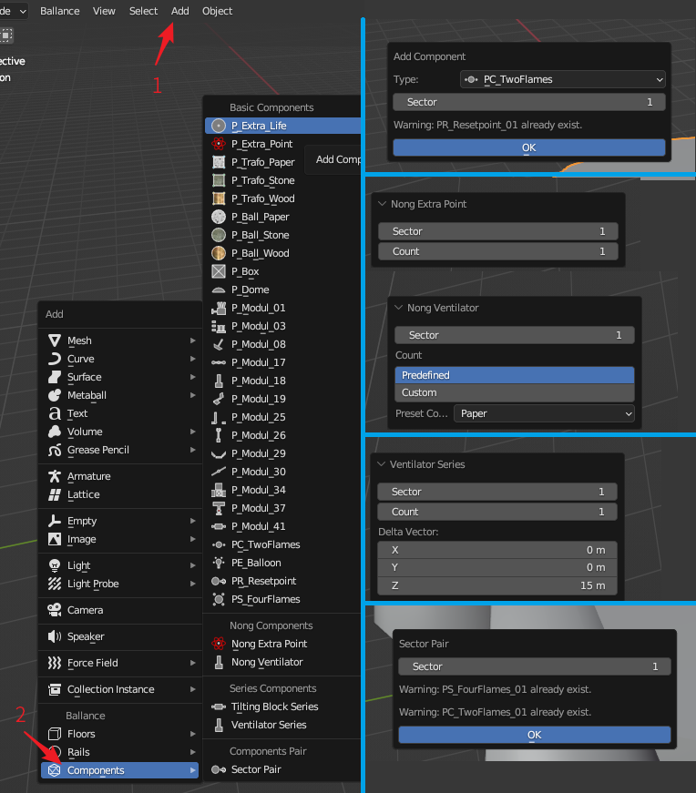

# Add Component

In the 3D view, click `Add - Components` to expand the Add Components menu. The menu is shown on the left side of the image below.

The right side of the image above shows the interface for adding some components, which will be described in turn, from top to bottom on the right side are: Add Checkpoint, Add Nong Extra Point, Add Nong Ventilator, Add Ventilator Series, Add Sector Pair.

## General Components

In the Add Components menu, under the `Basic Components` category, you can add general components. For most components, adding an component requires specifying the sector it belongs to, indicating that the component is only active in that sector. However, there are some exceptions:

* PS_FourFlame: the 4-flame platform at the start of the level, which is globally unique and therefore has no sector attribute.
* PE_Ballon: the ship at the end of the level, globally unique and therefore has no sector properties.
* PC_TwoFlames: the checkpoint for the sector, with a sector attribute. However, it should be noted that its sector attribute refers to which sector it is going to check, for example, specifying a sector attribute of 1 means that it is the checkpoint of the first sector, i.e. the start of the second sector, and the second sector will be opened after passing it.
* PR_Resetpoint: the reset point of the sector with the sector attribute. However, it is important to note that the sector attribute indicates which sector it is the respawn point of. It follows that when PC_TwoFlames and PR_Resetpoint appear in pairs, PR_Resetpoint is always labeled 1 greater than PC_TwoFlames.

!!! info "Automatic name conflict detection"
    A portion of the components have unique names in a Ballance map, e.g., there is and can only be one start point and one ending ship, only one checkpoint and one respawn point can exist in the same sector, etc.
    
    BBP provides a name detection function when creating these components, and if the name already exists, it will be shown in text below when creating to remind users not to create duplicates. As shown in the upper right corner of the display image above as an example, it is trying to add a PC_TwoFlames that already exists and receives a warning.

## Add Nong Components

In the Add Components menu, under the `Nong Components` category, you can add nong components. We only provide two common types of nong components: Nong Extra Point and Nong Ventilator.

### Nong Extra Point

To add a nong extra point, you need to specify the number of nong extra point and the sector number of it. It also will automatically rotate the nong extra point with a slight degree one by one to make the nong extra point look better in the game.

### Nong Ventilator

Nong ventilator are also added by specifying the number of nong ventilators and the sector number of ventilators. The difference is that we have provided some preset values for constructing nong ventilator that will just blow up wood or stone balls, and if you are not satisfied with these preset values, you can still enter the number yourself.

!!! info "Ventilator arrays are also possible"
    Did you know that nong ventilators are also possible by setting the offset to 0 when adding a ventilator series? The nong ventilator creation here is just providing some preset values.

## Add Series Components

In the Add Components menu, under the `Series Components` category, you can add series components (aka. component array). We only provide two types of commonly used series: fTilting Block Series and Ventilator Series.

### Tilting Block Series

Tilting Block Series requires you to provide the number of tilting blocks and the number of tilting blocks, and you can also adjust the spacing between adjacent tilting blocks, the default spacing is taken from the game.

### Ventilator Series

The ventilator series also requires sector number and count of ventilators, however it provides a 3D offset so that you can build a vertical or horizontal ventilator series. The default offset values are taken from the in-game values for vertical ventilator series.

## Add Components Pair

In the Add Components menu, under the `Components Pair` category, you can add pairs of components. Currently, only one type of pairs can be added: Sector Pair.

### Sector Pair

To add a Sector Pair, you need to enter a Sector number and it will automatically generate a pair of the checkpoint and respawn point components for you. For example, if you enter 1, it will automatically generate a 4-flame start point and a respawn point for Sector 1, if you enter 2, it will generate a checkpoint for Sector 1 and a respawn point for Sector 2, and so on.

!!! info "Automatic name conflict detection"
    Similar to normal component additions, sector pair additions have the same name conflict detection. As an example, the lower right corner of the image above shows that the sector pair for sector 1 already exists and does not need to be added.
