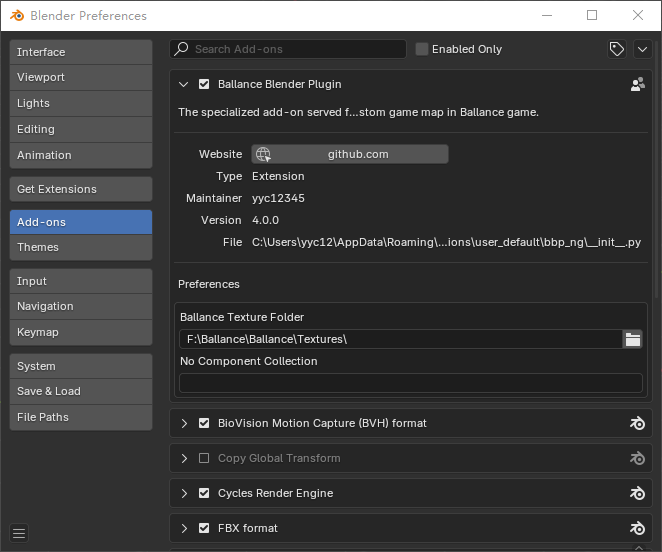

# Configure Plugin

!!! info "The plugin must be configured first"
    Some of the configurations of the BBP plugin are closely related to the use of the plugin, and only when the BBP plugin is correctly configured can the full functionality of the BBP plugin be used.

    **Whether installing for the first time or updating**, reconfiguring the plugin is essential to ensure that the settings are correct.

## Open the Configuration Panel

Open Blender, select `Edit - Preferences`, in the window that opens go to the `Add-ons` tab and find the BBP plugin in the list. Its name is `Ballance Blender Plugin`. Make sure that the checkbox next to the name is checked, which means that the plugin is enabled. Click on the triangular arrow to the left of the checkbox to expand the plugin details to enter the configuration panel as shown in the figure.

## Start to Configure

The BBP plugin currently has 2 settings to configure.

### External Texture Folder

Please fill in the `Texture` directory of Ballance, from which the plugin will use the external texture files (i.e. the ones Ballance originally came with). Click on the folder button on the right to browse the folders and select it.

This option is almost mandatory. If you don't fill it, various core functions like Virtools file import export, BME creation, rail creation, etc. will not be available (button is in grey color).

This is crucial for BBP to work properly, and only if it is filled correctly will BBP not make errors during operation.

### No Component Collection

When importing and exporting BM files, objects that are in a collection with this name will be forced to be specified as No Component. leaving this blank means that this feature is not needed. This feature is usually used for forced element model replacement.

!!! warning "This setting is not required at this time"
    Since BBP 4.0 supports native import/export of Virtools files, the BM file import/export function is no longer used. Therefore, this field is no longer useful and does not need to be filled in.
