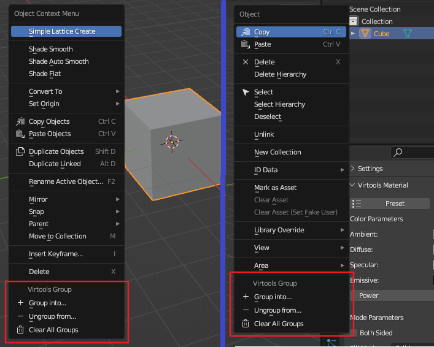

# Group Operation

## Select by Group

`Ballance - Select by Virtools Group` provides a feature to filter by Virtools grouping data.

The feature starts with 5 different selection strategies that match Blender's selection methods exactly (Set, Extend, Subtract, Invert, Intersect). Simply use it like a Blender selection. Then, select the name of the group you need and start a selection or filter.

!!! note "About pattern selection"
    If you can, use the Subtract or Intersect modes whenever possible. Because this avoids analyzing too many objects. For example, selecting a general range first and then filtering using Intersect mode is more efficient than using Set mode directly.

## Quick Grouping

The BBP plugin adds the ability to quickly group objects in 2 places. The first is the object context menu: you can select a series of objects and right click to find the quick grouping feature in the object context menu. Second is the Objects menu in Outline view: you can right-click on a selection of objects in the Outline view to find the quick grouping feature. Both menus are shown below.

### Group into...

Groups the selection into the group of your choice.

### Ungroup from...

Ungroups the selection from the group of your choice.

### Clear All Groups

Clear all groups for the selection. You will be asked to confirm this before executing to avoid misbehavior.
