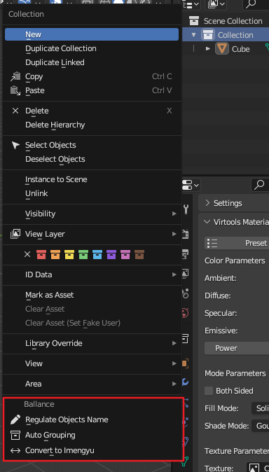

# Naming Convention

## Auto Grouping and Renaming

In the outline view, right-click on any collection to get the Auto Grouping and Renaming menu.

This plugin currently supports two naming convention.  
One is the Mapping Toolchain Standards described in the [Technical Information](./tech-infos.md) section, which is named `YYC Tools Chains` in this plugin.  
The second is the naming standard used by [Imengyu/Ballance](https://github.com/imengyu/Ballance), named `Imengyu Ballance` in this plugin.

These functions will ultimately only show a generalized message of success or failure. If you need to see in detail why a certain object is not converted, click `Window - Toggle System Console` and the plugin has more detailed output there.

### Rename by Group

Renames an object to an appropriate name based on its current grouping information.  
This is often used when migrating original maps. Some Ballance-derived programs do not have a Virtools Group concept and therefore rely on names for grouping information.

### Convert Name

Switch between different naming standards.  
Typically used to convert between different Ballance-derived programs.

### Auto Grouping

Auto-fill the grouping information for an object according to a given naming convention.  
Note that the original grouping information will be overwritten.  
If you follow certain naming conventions during the mapping process, this feature can do the grouping for you automatically.
