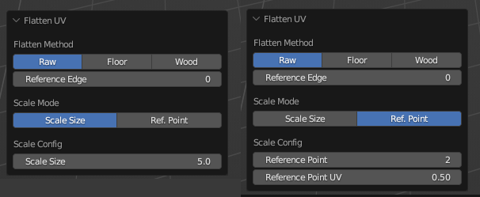
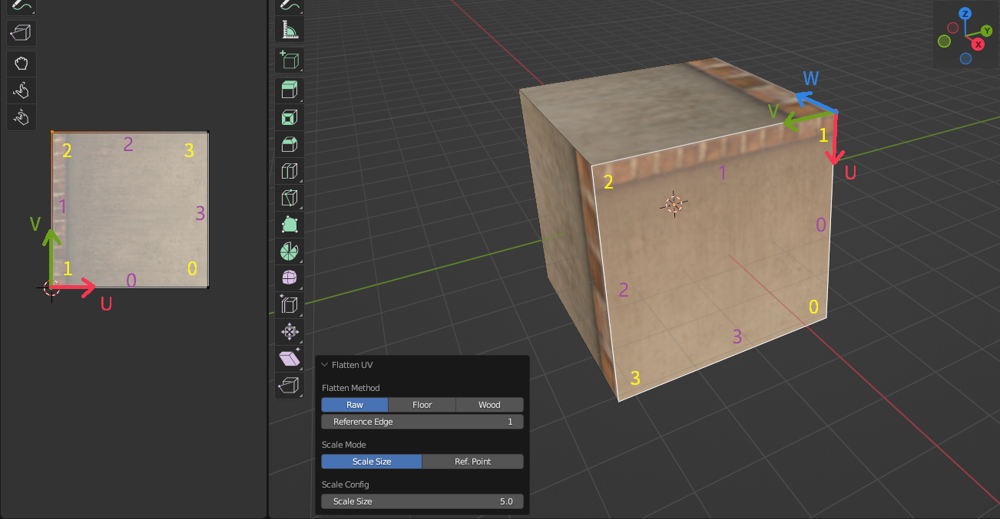
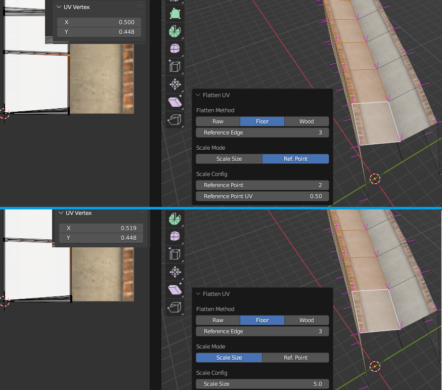
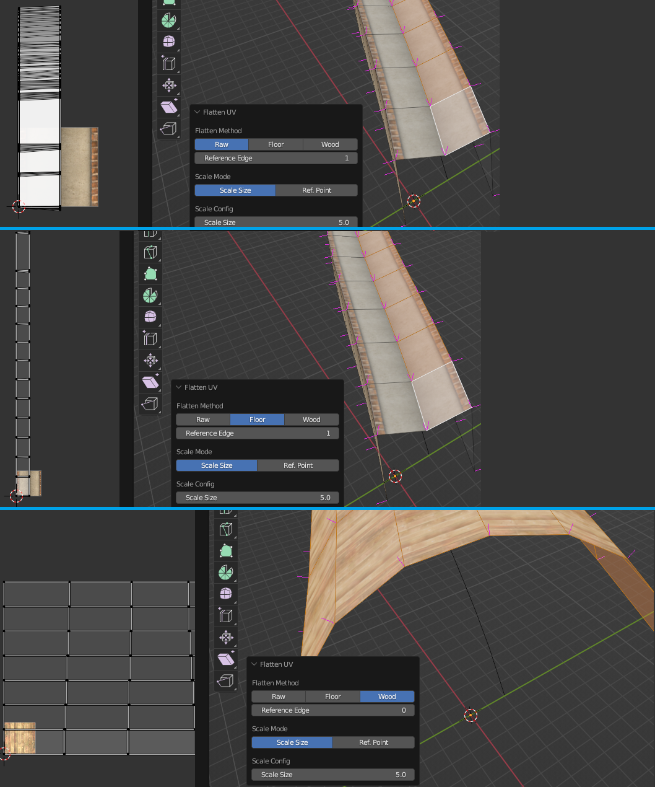

# UV Mapping

## Rail Mapping

The menu `Ballance - Rail UV` in the 3D view provides the ability to map rails.

To start mapping rails, you need to select the rails to be mapped (multiple selections are possible) and then click on this menu. Then you only need to select the material used for the rail. This will clear all materials for the selected object and assign all materials used on each face to the material you specify. Then you will set the UV of the selected object in the same way as the rails are post-processed in Ballance, so that the rails will have the same appearance as in the game by performing this operation.

!!! info "Rails UV doesn't really matter"
    In fact, all objects grouped in the `Phys_FloorRails` group undergo a post-processing when Ballance loads the level. What the post-processing method does is to reset the UVs of these objects according to a specific mapping function (`TT_ReflectionMapping` is called in Virtools). So the UVs of the rails don't really matter, because Ballance will set them uniformly for you when you enter the game, and even if you don't set any UV data to the rails, the rails will look correct when you enter the game.

    Therefore, this feature is usually applied to set the UVs for objects that are not grouped in the `Phys_FloorRails` group, but you still want them to show the appearance of the rails material. Or for rendering Ballance map previews in Blender, etc.

## Mapping Along Edges

Mapping Along Edges is the most important feature of the BBP plugin, the most powerful and at the same time the most difficult to understand. It is widely used for setting UVs of custom structures or a line of floor, wood, etc. The menu `Ballance - Flatten UV` in the 3D view offers the Mapping Along Edges feature. It only works in **Edit Mode**, so you need to be in Edit Mode (and entering Face selection mode at the same time, since Mapping Along Edges operates on faces) to use it.

Mapping Along Edges is usually used in combination with [Select Face Loops](https://docs.blender.org/manual/en/4.2/modeling/meshes/selecting/loops.html), [Shortest Path](https://docs.blender.org/manual/en/4.2/modeling/meshes/selecting/linked.html#bpy-ops-mesh-shortest-path-select) and other functions. You need to first select a series of faces, for example a series of consecutive Ballance floor sides, and then click `Ballance - Flatten UV` to start mapping along edges.

The configuration screen for Mapping Along Edges is shown below, with Scale Size mode on the left and Ref. Point (refernece point) mode on the right, we'll explain the difference between these two modes later.

Mapping Along Edges, as the name implies, means UV mapping along a certain edge. The specific operation is to use linear algebra to transform the 3D coordinates of the vertices under a new coordinate system using a transition matrix. In this new coordinate system:

* The origin is the vertex with the index specified by the Reference Edge, as shown below. The figure below identifies the vertex index of the face in UV and 3D in yellow font, and the Reference Edge is 1 in the figure, then the vertex with the vertex index of 1 in the current face is used as the origin of the new coordinate system.
* The Y-axis (i.e., the V-axis, XYZ corresponds to UVW, and will not be commented subsequently) is the line from the vertex specified by Reference Edge to the next vertex, i.e., the edge from vertex 1 to vertex 2, i.e., the edge with the serial number of 1, as shown in the following figure, which identifies the serial number of the edge of the face in purple font in the following figure in UV and 3D. Edge 1 is a vector that starts at vertex 1 and ends at vertex 2. It has a direction, is a vector, and needs to be normalized when used as a coordinate axis.
* The Z-axis is obtained by cross-multiplying and normalizing the edge specified by Reference Edge (in this case, Edge 1) with its next neighboring edge (in this case, Edge 2). In the case of a three-point covariance where the cross-multiplication yields a zero vector, an attempt is made to use the normal data of the face instead.
* The X-axis is obtained by cross-multiplying and normalizing the previously calculated Y-axis and Z-axis. The XYZ in the new coordinate system still needs to satisfy the requirements of the right-handed coordinate system.

After setting up the new coordinate system and building the transition matrix and transforming every vertex to the new coordinate system, we can discard the Z component and map XY to UV and mirror the vertices on the -U axis to the +U axis, which is why Flatten UV doesn't support concave polygons. The reason for mirroring is to prevent UV mapping errors, for example, in the above image, the upper edge stripe of the floor side mapping is located in the V-axis, if we flip the UV vertices in the above image along the V-axis (you can try it for better understanding), it will result in the final mapping display does not meet our expectation, i.e., the edges specified by Reference Edge do not show the floor side stripe.

!!! info "Reference Edge actually refers to"
    The Reference Edge actually refers to the index of the edge that needs to be mapped to the V-axis. Because this edge is directional, it also determines the origin in the new coordinate system.
    
    In short words, Flatten UV allows the user to specify an edge and then flatten it along the V-axis of the UV.

After determining the coordinate system, we also need to know how far this UV mapping needs to be expanded, specifically what the scaling value of this UV mapping should be. For the V-axis direction, due to the Ballance mapping charcateristic (Ballance mapping always extend along the V-axis, and in Ballance, 5 in 3D is equivalent to 1 in UV), we can know the UV:3D relationship is 1:5. While for the U-axis direction, we can't determine it, that's the work of Scale Mode property, which lets the user decide the scaling of the U-axis direction.

The Scale Size mode allows the user to directly specify the scale value, for example, the default value of 5 means that 5 in the 3D world is equal to 1 in the UV world, while the Ref. Point mode allows the user to specify the U value of the UV of a reference point in the surface, and lets the plugin calculate the scaling on the U-axis by itself. For example, if we switch the Scale Size mode in the image above to Ref. Point mode and specify Reference Point as 2 and Reference Point UV as 1 we can also apply the same texture, let's explain the principle here. First of all, Reference Point specifies the reference point, this reference point is relative to the vertex specified by Reference Edge, that is, the reference system origin of the offset, so here, Reference Edge is 1, Reference Point is 2, then the actual reference point for the vertex 3. Reference Point UV specifies a U value of 1 in the UV value of this point, i.e., it can be seen as forcing vertex 3 to be placed at a U-axis of 1. BBP will calculate the corresponding U-axis scaling value based on this point and apply it to all vertices.

Scale Size mode is usually used for floor side mapping, since these faces have fixed U-axis scaling values. The Ref. Point mode is typically used for maps where the scaling value cannot be determined (usually due to model deformation that causes the scaling value to fluctuate around the standard range of scaling values), such as the upper surface of a sink floor generated from a curve with bevel shape, as shown in the following figure. We can be sure that the UV of the center of the sink floor must be 0.5, but it is not convenient to determine its scaling value because it is difficult to calculate it, so we just use the Ref. Point mode. The top half of the figure below shows the mapping result in the Ref. Point mode, and the bottom half is in the Scale Size mode. We can observe that in the Scale Size mode, the UV of the center of the sink floor is not exactly 0.5, which results in the center of the sink floor not being dark enough on the display. The Ref. Point mode, on the other hand, accurately sets the UV of the center of the sink floor to 0.5.

Finally, Flatten Mode specifies the unfolding mode, Raw means that the connection between faces is not considered at all, and each face is treated as an independent content, Floor means that the continuity of adjacent faces in the V-axis direction is taken into account, and adjacent faces will be made adjacent in the UVs as much as possible, which can avoid the problem of visual duplications caused by Raw unfolding in the case of too many subdivisions of the road surface. Floor is often used in floor mapping, so it's called Floor. Wood is similar to Floor, except that it not only considers continuity on the V-axis, but also on the U-axis, which is often used in concave and convex wood mapping, and is the reason of its name.

The figure below shows the distribution of UV mapping for three different unfolding modes. At the top is the Raw mode, where you can see that the Reference Edge of each face is expanded at the UV coordinates of the origin. In the middle is the Floor mode, where you can see that BBP unfolded a series of consecutive faces along the V-axis, instead of stacking them all at the origin as in the Raw mode. At the bottom is the Wood unfolding mode, which is unfolding a convex wood, and you can see that the continuity of the faces has been taken into account on both the V and U axes.

!!! info "Floor and Wood Flatten Mode failed"
    Floor and Wood mode have more limitations than Raw modes, they only support rectangle faces, and they require a lot of modeling operations, usually only the geometry generated by batch operations (e.g. subdividing, lofting, etc.) will be correctly recognized by Floor and Wood.

    If Floor and Wood unfolding modes fail and the resulting unfolded maps are completely unacceptable, try modeling in a more prescriptive way or switch to manual mapping.
