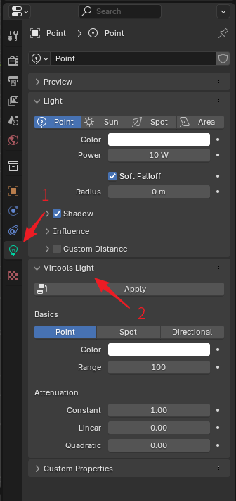

# Virtools Properties

## Virtools Group

The BBP plugin adds a new property to every Blender object, called Virtools Group. has the same functionality as Group in Virtools. Select an object and the `Virtools Group` panel can be found in the `Object` properties panel.

In the `Virtools Group` panel, you can click Add to group objects. After clicking the Add button, you can select Predefined and then select one of all legal Ballance group names to add. Or select Custom and enter the group name you want to add. The selected Virtools group can also be deleted by clicking the Delete button. Finally, all group data for this object can be deleted at once by clicking the Trash icon button (which will let you confirm before deleting).

BBP also provides access to Virtools groups in Blender's other menus, see [Group Operation](./group-operations.md).

It is important to note that the Virtools group only works on mesh objects. When you open the Virtools group panel on other objects, you will see a warning message in the panel indicating that the Virtools group is invalid for that object. Although the Virtools group data set on non-mesh objects will be recognized and stored by Blender, it will not be saved to the Virtools file when exporting.

## Virtools Material

The plugin adds a new property to every Blender material, called Virtools Material, which bridges the gap between Virtools materials and Blender materials. Go to the `Material` properties panel and select a material to find the `Virtools Material` panel.

You can set material properties in the `Virtools Material` panel, just like in Virtools. All material parameters in the `Virtools Material` panel are maps of the material parameters in Virtools and will be accurately reflected in the final saved Virtools document.

The `Virtools Material` panel provides a preset function, which can be started by clicking the `Preset` button at the top. The preset function allows the user to use some preset material settings, such as the material data for the top surface of the road, the sides, etc., for ease of use. Note that using a preset does not affect the material's texture options, and you will still need to set the material's texture manually once the preset has been applied.

The `Virtools Material` panel also provides the ability to convert the material data in the `Virtools Material` panel to the Blender material for a visual effect in Blender. Click the `Apply` button at the top to perform this function. When you save a Virtools document in Blender, the material data in the Virtools document will be retrieved from the values specified in the `Virtools Material` panel and not from the Blender material. This means that a proper procedure for setting up a material is to edit the material parameters in the `Virtools Material` panel and then use the `Apply` button to convert them to the Blender material, instead of editing the Blender material directly.

The `Virtools Material` panel provides material repair functionality, which is inherited from the [Ballance Virtools Plugin](https://github.com/yyc12345/BallanceVirtoolsHelper). The Material repair button is located to the right of the `Preset` button and the `Apply` button, and is a button with a wrench icon. Clicking it requires reconfirmation to prevent misuse. The material repair function determines which type of material the current material is based on the filename of the texture file it references, and then modifies the other parameters to make it visually appealing based on our preset repair settings (taken from the game). This is usually used for fixing objects that look like they have the wrong material in the game, such as a black Stopper, etc.

!!! info "There is also a global material fix function"
    In the 3D view, the menu `Ballance - Fix Material` is similar to the material fix function, but it will fix all materials within the current document. Don't use this feature unless you are sure that all materials in the current document need to be fixed, as it may set some of the originally special, correct materials back to generic values that you don't want.

    The Global Material Repair function also needs to be reconfirmed after clicking on it before it can be used, to prevent misuse.

The Texture property in the `Virtools Material` panel not only allows you to select a texture within a document by clicking on it, but also opens the Texture File Browser by clicking on the folder button on the right side, which allows you to select the texture you want directly from the file system (much faster than selecting it from the Shading tab). The file browser is navigated in Ballance's Texture directory by default, to make it easier to select Ballance materials.

## Virtools Texture

The BBP plugin adds a new property to all Blender textures (actually Images) called Virtools Texture, which creates a link between Virtools textures and Blender images.

Unlike Blender materials, due to Blender's implementation there is no separate properties panel for textures, so we can only access Virtools texture properties in an indirect way in the `Virtools Material` panel. First find the `Virtools Material` panel by referring to the instructions in the `Virtools Material` chapter, then select a texture or open a texture in the material slot in the `Virtools Material` panel, and you'll see that the Virtools texture attributes are displayed additionally underneath the texture attributes of the material, as shown in the highlighted portion of the image below.

Among them, Save Option indicates how the texture is stored in Virtools, and these are the common storage methods:

* External: The file only stores the name of the referenced file. All Ballance native textures should use this mode.
* Raw Data: The texture is stored inside the file, the disadvantage is that it will lead to a large file. All non-native Ballance maps should use this mode.
* Use Global: Use global settings. We do not recommend using this unless you are modifying an existing map. We recommend explicitly specifying how individual textures are stored right here, rather than using global values. The global setting is determined when exporting the Virtools document.

The Video Format indicates the rendering mode of the texture in Virtools, and these are the commonly used modes:

* 32 Bits ARGB8888: The storage mode for all kinds of textures with transparency, such as the column gradient part.
* 16 Bits ARGB1555: The way to store all kinds of maps without transparency, such as floor.

## Virtools Mesh

The BBP plugin adds a new property to all Blender meshes called Virtools Mesh. go to the `Data` properties panel to find the `Virtools Mesh` panel.

The Virtools Mesh is currently only used as a compatibility feature. It has only one property, Lit Mode, that can be set. Most early maps had black floor issue because they didn't know how to set the material correctly, so the Lit Mode was often set to Prelit to get the floor to show up properly. This attribute exists for compatibility with this compromise and the user usually does not need to set this option.

## Virtools Light

The BBP plugin adds a new property called Virtools Light to all Blender lights. You can find the Virtools Light panel by navigating to the Data properties panel.

Similar to the materials in Virtools, the lighting system in Virtools differs significantly from that in Blender. The Virtools Light acts as a bridge, accurately reflecting the settings of Virtools, allowing for seamless storage within Blender files and providing necessary data during import and export. Additionally, this panel includes an Apply button to apply the Virtools lighting settings to Blender's lighting.
