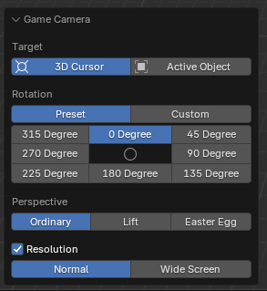

# ZZQ Features

This plugin received many suggestions from ZZQ during its development process, resulting in a rather disordered set of features, which are therefore described together on a separate page.

## Snoop Group then to Mesh

Snoop Group then to Mesh, fully referred to as: snoop and copy the Virtools Group infomations into corresponding curve object and convert it into mesh object. You can select certain objects and then right-click to find this function in the context menu of the object.

This function, as its name, converts the selected object into a mesh. If the selected object is a curve and there is a beveled object set, the grouping information of the beveled object will be assigned to the current curve (overriding the curve's current grouping settings). If the selected object is not a curve, or if it is a curve but lacks a beveled object, then this function is basically the same as executing a conversion to mesh. This function is extremely useful in loft modeling, as it only requires the correct grouping of the section object, after which using this function to convert the curve to a mesh will ensure that the grouping of the lofted object is correct.

## Game Camera

Many map makers often lack a clear concept of the size of their maps when creating them, which can easily lead to the production of maps that are either too large or too small. The in-game camera function of the menu item `Ballance - Game Camera` offers a way to preview the map from the perspective of the in-game camera within Blender, allowing map makers to better grasp the dimensions of the map.

In order to use this feature, there must first be a camera in your scene, set as the active camera of the scene (when no camera is present, a newly added camera through the add menu will be automatically set). Additionally, you will need an active object, which cannot be the same as this camera.

!!! question "Why is it necessary to have active object?"
    Due to the limitations of the Blender plugin, an active object is required since the in-game camera functionality supports targeting either the 3D cursor **or an active object**.

    Typically, the situation where there are no active objects available only occurs in a blank Blender document, which consequently renders the functionality unavailable. In a custom map, there is no any lack of objects which can become active objects; simply clicking on any object is enough (when wishing to use the 3D cursor as a target).

After clicking this function, the view will automatically switch to the perspective of the active camera, facilitating your preview. You can adjust the relevant settings in the panel located at the bottom left.

First, select the target, which essentially means choosing the position of the player's ball. If 3D cursor is selected, it is treated as the origin of player's ball. If active object is selected, the player's ball is placed at the origin of the active object.

!!! info "The position of the player's ball is not that straightforward."
    Regardless of whether one chooses 3D cursor or active object, if no extremely fine adjustments are made, the preview results may have slight differences compared with in-game result.

    When you use the 3D cursor mode and simply snap it to the ground, it does not represent the position of player ball. Since the radius of player ball is 2, you actually need to move 2 units in +Z direction to achieve the exact same perspective as in the game. However, this operation is too complex, and not performing this action does not cause a significant difference in the preview effect.

    When using active object mode, it is important to note that the origin of the object corresponds to the position of the dot displayed in viewport when the object is selected. For most objects, this may not be what you desire, as they may be located inside or outside the object, and are not always positioned on the surface of the object or at the center of a particular face. To address this situation, I recommend using the 3D cursor as a target and, by entering edit mode, utilizing snapping and the `Shift + S` menu to place the cursor in the correct position.

Next is the selection of the camera's rotation angles. We offer 8 common used in-game preset angles, corresponding to 4 each for 90 degrees camera and 45 degrees camera. Furthermore, if these preset angles do not meet your requirements, you can also set custom angles.

Finally, there is the selection of camera perspectives, which can be divided into 3 types: Ordinary (standard perspective), Lift (perspective activated by holding the spacebar), and Easter Egg (special Easter Egg perspective).
