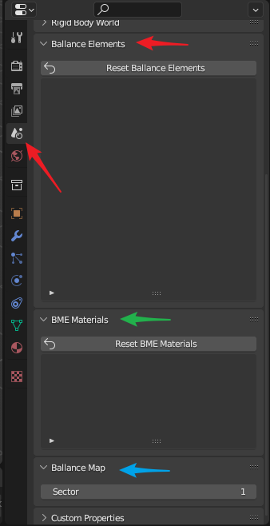

# Ballance属性

Ballance属性有别于Virtools属性，它是专门为Ballance制图服务的一系列属性。这些属性寄宿于场景，在同一场景中（制图不会涉及Blender中的场景切换），这些属性不会改变。在`Scene`属性面板可以找到Ballance属性相关的面板，如下图所示，分别是：

* `Ballance Elements`面板（红色箭头），对应Ballance机关
* `BME Materials`面板（绿色箭头），对应BME材质
* `Ballance Map`面板（蓝色箭头），对应Ballance地图信息

其中，只有Ballance地图信息是你需要重点关注的，其它属性在通常情况下不需要关注，除非地图中的某些材质或网格出现错误后，才需要关注这些属性。

## Ballance地图信息

Ballance地图信息目前只有一个选项，Sector（地图小节数）。此属性指示了当前地图的最终期望小节数。这个属性主要是用于解决导出地图Bug的，具体Bug内容可参考导入导出Virtools文档章节。

你需要做的唯一一件事就是在导出最终地图前检查此字段是否是你期望的小节数。需要注意的是，尽管你可以在创建地图的一开始就设置此字段，然而BBP中的其它一些功能可能会修改此字段，比如：添加机关，导入Virtools文档等。例如当你的地图小节指定为3，你正在添加一个归属于第4小节的机关，那么此值会自动增加到4。同理，在导入一个总共4小节的Ballance地图时，此值也会增加到4（如果先前值小于4的话）。这主要是为了用户可以在没有感知到此值的情况下使用此插件，尤其是在对某些现有地图进行略微修改时。然而如此操作，可能会在某些情况下不能满足用户的需求，所以仍建议你在导出前检查此字段。

## Ballance机关

Ballance机关记录了你所有使用BBP添加机关功能添加的机关的网格。在3D文件中，通常而言网格占据了最大的数据量，因此减少网格的数量，即通过在各个相同形状的物体之间共享网格，可以大幅减少地图文件所占用的大小。当你使用BBP添加机关相关功能时，会首先尝试从这里获取机关的网格，如果没有对应网格，则加载并记录在这里。

这个面板只供查看，不可编辑。当你不小心修改了BBP添加的机关的网格（它们本不该被修改）后，想要恢复其原有形状时，只需点击`Reset Ballance Elements`即可将列表中的所有机关网格重置为正确状态。

## BME材质

与Ballance机关类似，记录了使用BME添加路面时使用的材质。这也是为了可以复用材质而设计的，这样就不需要每创建一个物体就创建一套与之相关的材质，大大减少了重复材质的数量。

这个面板只供查看，不可编辑。当你不小心修改了BME相关的材质（它们本不该被修改）后，想要恢复其原有材质时，只需点击`Reset BME Materials`即可将列表中的所有材质重置为正确状态。
