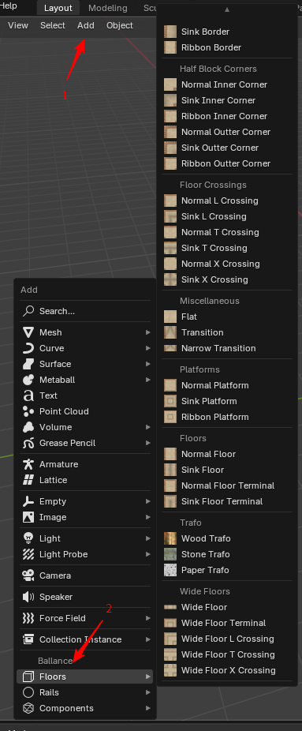

# 添加路面

## 开始生成

在3D视图中，点击`Add - Floors`可展开添加路面菜单。菜单如下图所示。

点击菜单后可以在弹出的子菜单中查看所有受支持的路面类型。其名称和图标提示了它所要创建路面的样式与形状。

!!! info "BME是可扩展的"
    BME的路面添加器是可扩展的，菜单中的每一个项实际上都由一组JSON数据描述。您可以阅读[技术信息](./tech-infos.md)章节来了解我们是如何编写这些JSON的，甚至您还可以根据你的需求自行扩展BME可创建的路面种类。

## 配置路面

点击其中一个路面类型，将打开路面创建对话框，这里我们展示的是Normal Platform（平面平台），如下图所示。在对话框里我们可以配置这个路面类型的各种属性，例如长宽高等距离属性，面的显示与否的属性等，来定制它生成的几何模型，以使其符合我们的要求。

在Normal Platform的对话框中，我们首先可以看到它要求我们提供路面的长度，宽度，这决定了我们平台的大小，下面还有对应的文字描述来帮助你理解这个属性具体是控制着什么。

然后它还需要我们提供这个平台的高度，高度默认为5，即Ballance中默认的路面高度大小，小于5将创建类似“魔虬”地图中的薄路面，大于5将创建类似“魔脓空间站”中非常高的路面墙体。

最后它指示我们需要配置这个路面哪些面需要显示。需要注意的是，Top和Bottom指的是沿高度方向（Z轴）的顶面和底面，而Front，Back，Left，Right则是以头顶朝向-X轴，眼睛朝向-Z轴俯视状态下的前后左右。您可能注意到这6个面按钮中间有一个透视的六面体，实际上这六个面的选项的位置与这个透视六面体的六个面的位置是一一对应的。

## 额外变换

在BME配置对话框的底部，您总是可以找到一个被称为额外变换的区域。在这个区域中，有额外移动和额外旋转两个选项可以配置。这些字段主要是为了可视化服务的。

在说明这些字段的实际作用前，你需要知道，BME创建的路面总是以当前3D游标的位置进行创建的，即3D游标在哪里，新创建的路面就在哪里。这主要是为了可视化来考虑到，用户可以先将3D游标移动到想要添加路面的位置，再添加对应的BME结构，便可以在调整参数的时候即时预览到结果。有时候你的3D游标的位置不是那么的准确，又或者最终生成的结构需要一定的旋转才是你期望的，此时就可以利用额外变换字段，为最终生成的结构，增加相对于3D游标的额外的移动和旋转，使之处于正确的位置，这样就可以在调整参数的时候实时预览到结果了。

## 小贴士

每个路面类型，其配置的条目数是不同的，因此对于不同路面类型，需要根据配置的提示文本来了解对应配置具体是做什么的。一些路面类型所需要设置的条目可能很多，另一些则根本没有配置条目。

路面类型配置的默认值被设置为创建此路面时最常用的值。每一次切换路面类型或重新创建时，都会将值重置为默认值。
