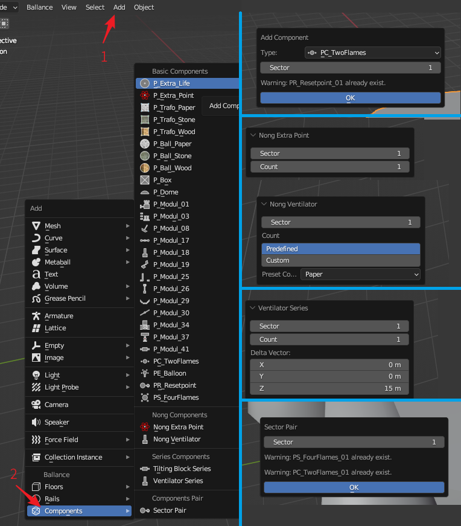

# 添加机关

在3D视图中，点击`Add - Components`可展开添加机关菜单。菜单如下图左侧所示。

上图右侧则展示了一些机关添加的界面，会在后续依次介绍它们，右侧从上到下分别是：添加Checkpoint（检查点）、添加Nong Extra Point（脓分）、添加Nong Ventilator（脓风扇）、添加Ventilator Series（风扇阵列）、添加Sector Pair（盘点对）

## 普通机关

在添加机关菜单中，`Basic Components`分类下的是普通机关的添加。对于大多数机关而言，添加机关需要指定其所属小节，表示这个机关只在这个小节中激活。然而有一些例外：

* PS_FourFlame：关卡开始的4火焰盘点，全局唯一，因此没有小节属性。
* PE_Ballon：关卡终点的飞船，全局唯一，因此没有小节属性。
* PC_TwoFlames：小节的检查点，具有小节属性。但需要注意的是，其小节属性指的是其要检查哪个小节，例如指定小节属性为1，则表示它是第一小节的检查点，即第二小节的开始，通过后开启第二小节。
* PR_Resetpoint：小节的重生点，具有小节属性。但需要注意的是，小节属性表示它是哪个小节的重生点。由此可知，当PC_TwoFlames和PR_Resetpoint成对出现时，PR_Resetpoint总比PC_TwoFlames的标号大1。

!!! info "自动名称冲突检测"
    一部分物体在一张Ballance地图中名称是唯一的，例如开头盘点与终点飞船有且只能有一个，小节检查点与复活点同一小节只能存在一个等。
    
    BBP在创建这些机关时提供了名称检测功能，如果名称已存在，会在创建时在下方用文字显示出来，以提醒用户不要创建重复的内容。如上文展示图右上角显示为例，其正在尝试添加一个已经存在的PC_TwoFlames并收到了警告。

## 添加脓机关

在添加机关菜单中，`Nong Components`分类下的是脓机关的添加。我们只提供两类常用脓机关的添加：脓分和脓风扇。

### Nong Extra Point

脓分添加需要指定脓分的小节号和个数。并且会自动帮用户对脓分实现一个逐个旋转的效果，以让游戏内的脓分显示的更好看。

### Nong Ventilator

脓风扇的添加同样要指定小节号和个数。不同的是我们提供了一些预设数值，这些预设数值构造的脓风扇可以恰好吹起木球或石球，如果你对这些预设数值不满意，仍可以自行输入数量。

!!! info "风扇阵列也可以"
    你知道吗，在添加风扇阵列时将偏移设为0也可以实现脓风扇。这里的脓风扇创建只是提供了一些预设数值罢了。

## 添加阵列机关

在添加机关菜单中，`Series Components`分类下的是阵列机关的添加。我们只提供两类常用阵列机关的添加：浮板阵列和风扇阵列。

### Tilting Block Series

浮板阵列需要提供小节号和浮板个数，并且还可以自由调整相邻浮板之间的间距，默认间距取自游戏内。

### Ventilator Series

风扇阵列也需要提供小节号和风扇个数，然而它提供三维的偏移量，这样你就可以构建竖直的风扇阵列或水平的风扇阵列。默认偏移数值取自游戏内竖直风扇阵列的数值。

## 添加机关对

在添加机关菜单中，`Components Pair`分类下的是机关对的添加。目前只有一种机关对：盘点对可添加。

### Sector Pair

盘点对需要你输入一个小节号，它会为你自动生成盘点火与重生点机关对。例如输入1小节，则会自动生成4火焰盘点火和第1小节的重生点，输入2，则会生成第1小节检查点和第2小节重生点，以此类推。

!!! info "自动名称冲突检测"
    与普通机关添加类似，盘点对的添加也有名称冲突检测功能。上文图中右下角为例，其显示第1小节的盘点对已经存在，不需要添加。
