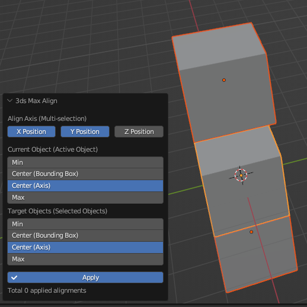

# 传统对齐

`Ballance - 3ds Max Align`提供了一种类似于3ds Max中对齐方式的对齐功能。

所谓传统对齐功能，是是将3ds Max中的对齐操作完美地在Blender中重新进行了实现。可以使得很多从3ds Max转来使用Blender的制图人可以更快地上手，并且提供了一些便捷的对齐操作。下图展示了正在运作的传统对齐。

## 使用方法

传统对齐支持将多个物体对一个物体的对齐，操作方法是先依次选中需要被对齐的物体，然后在最后选中对齐参考对象（也就是使其称为活动物体），然后点击`Ballance - 3ds Max Align`，即可弹出传统对齐面板，之后便可开始对齐操作。

## 面板介绍

在面板中，`Align Axis`指定了你要对齐的轴，此处可以多选以指定多个轴，不指定任何轴将无法进行对齐操作，因而也无法点击`Apply`按钮。

`Current Object`是对齐参考物体，也就是场景中的活动物体，通常也就是你选择的最后一个物体。在这个选项里指定你需要参考其什么数值进行对齐，分别有`Min`（轴上最小值）、`Center (Bounding Box)`（碰撞箱的中心）、`Center (Axis)`（物体的原点）、`Max`（轴上的最大值）可选。这些选项与3ds Max中的对齐选项是一致的。

`Target Objects`是正在被对齐的物体，可能有很多个，在这个选项里也是指定你需要参考其什么数值进行对齐。选项与`Current Object`含义一致。

`Apply`按钮点击后将把当前页面的配置压入操作栈，并重置上面的设置，使得你可以开始新一轮对齐操作而无需再次执行传统对齐。操作栈中的操作个数在`Apply`按钮下方显示。

!!! info "Apply按钮做了什么"
    了解这部分对制图没有用，除非你感兴趣，否则不需要阅读这个框里的内容。

    在设计上，Blender不支持所谓“在Operator内进行操作”，但是我们通过一些小把戏，模拟了一种类似于3ds Max中应用的效果。
    
    Apply按钮实际上是一个特殊显示的BoolProperty，通过监听其值变化事件，在避免递归调用的情况下，将当前设置记录在一个隐藏的CollectionProperty中，并重置自身数值和显示的属性，以达到“应用”的效果。Operator在执行过程中则是依次处理CollectionProperty中积攒的对齐要求。

