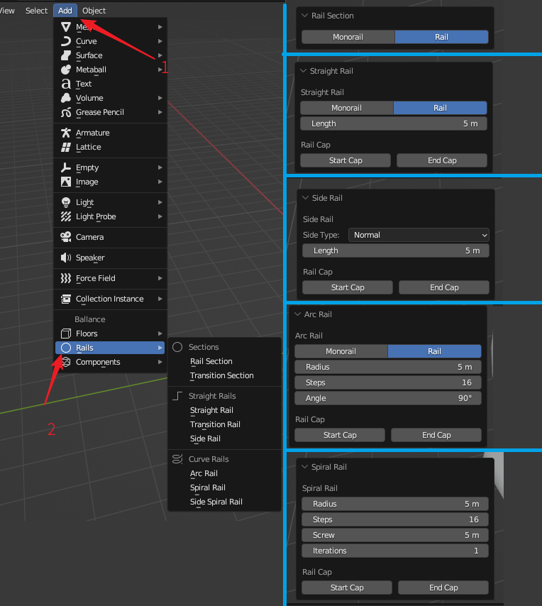

# 添加钢轨

在3D视图中，点击`Add - Rails`可展开添加钢轨菜单。菜单如下图左侧所示。

上图右侧则展示了一些钢轨添加的界面，会在后续依次介绍它们，右侧从上到下分别是：添加Rail Section（钢轨截面），添加Straight Rail（直钢轨），添加Side Rail（侧轨），添加Arc Rail（圆弧轨），添加Spiral Rail（螺旋轨）。

!!! info "非标准数据的钢轨"
    BBP的钢轨添加菜单是为新手玩家快速添加钢轨而设计的，并不是为老手添加钢轨而设计的。对于需要非标准数据的钢轨的情况，例如具有非标准间距或非标准截面的钢轨，你需要通过Blender自带的创建圆操作构建钢轨截面，然后通过挤出，桥接，又或者螺旋修改器生成整个钢轨。在这样的创作过程中，你可以随意控制每个步骤的所有参数，以满足你对钢轨参数的特殊需求。

!!! info "钢轨数据的来源"
    钢轨添加菜单的所使用的钢轨各类参数来源于游戏中的实际测量和Ballance社区中多位制图玩家十几年来总结的经验数据。

    钢轨截面半径与轨距由多年制图经验总结和测量所得。侧轨倾斜数据来源BallanceBug计算。单双轨转换下沉数据来源失衡之梦计算。螺旋轨间距来自第九关和第十三关测量。

## 钢轨截面

在添加钢轨菜单中，`Sections`分类下的是钢轨截面的添加。钢轨截面是钢轨的轮廓，钢轨截面的创建通常是各类异形钢轨的创建的开始步骤，例如通过放样，挤出等操作制作钢轨。

### Rail Section

钢轨截面创建一个钢轨截面，你可以在面板中选择创建一个单轨或双轨截面。

当创建单轨截面时，会自动将八边形的钢轨截面的平头朝上，双轨截面则不会。如果你需要修改这种行为，你需要在创建后进入编辑模式，手动旋转钢轨截面顶点使其钢轨截面的平头或尖头朝上。

### Transition Section

单双轨转换截面将创建一个适用于单双轨转换的钢轨截面。这个轨道截面的创建不需要指定任何参数。

## 直线钢轨

在添加钢轨菜单中，`Straight Rails`分类下的是直线钢轨的添加。

### Straight Rail

直钢轨是一段直来直去的钢轨。创建直钢轨需要为其指定Length（长度）。你也可以选择创建直的双轨或单轨。

当创建单轨时，与截面类似，会自动将钢轨截面的平头朝上，修改这一行为的操作则也是创建后进入编辑模式再旋转即可。

直钢轨的创建还支持封盖属性，这些特性由位于Rail Cap（钢轨封盖）下的Start Cap（始端封盖）和End Cap（末端封盖）选项控制，勾选后对应端将进行封盖。封盖即为钢轨的端面自动补面，并正确处理其法线问题，这通常用于确保钢轨与其它路面或物体接触的部分的美观，钢轨与钢轨之间的连接端无需封盖。

### Transition Rail

单双轨转换轨通常可被视为是Transition Section创建的进阶使用，将Transition Section创建的截面挤出并处理好法线问题即可得到此选项创建的结果。创建单双轨转换轨需要为其指定Length（长度），其也支持封盖属性。

### Side Rail

侧轨创建首先需要指定Side Type（侧轨类型）可以选择Normal（纸球木球用侧轨）或Stone Specific（石球专用侧轨）。纸球木球用侧轨就是通常意义上的侧轨，石球不可以通过。石球专用侧轨是倾斜度更大的侧轨，石球也可以通过，当然，纸球和木球也可以。

除了侧轨类型外，侧轨创建也需要Length（长度）和封盖属性。

## 曲线钢轨

在添加钢轨菜单中，`Curve Rails`分类下的是曲线钢轨的添加。

### Arc Rail

圆弧轨首先需要指定Angle（角度）和Radius（半径），表示这个圆弧轨将会以多少的半径转过多少角度。通常来说，角度以90度，180度，270度比较常见，当然也可以指定任意度数。半径则通常按需调整。对于双轨圆弧轨，半径是圆弧轨旋转圆心到双轨截面两轨中心连线的中点的距离；对于单轨圆弧轨，半径是圆弧轨旋转中心到单轨截面的中心的距离。

圆弧轨的Steps（步数），步数表示这个圆弧轨的分段数，数字越大，圆弧轨看起来越平滑，相对的，顶点也会更多，对存储空间和渲染的要求也越高，因此需要选择一个合理的数值。

圆弧轨的Flip（翻转）选项可以让你在指定的轴向上翻转（也可以视为镜像）生成的结构，三个轴上的翻转选项可以满足所有对应手性结构的生成。

圆弧轨同样支持双轨单轨选择，可以创建单轨圆弧轨和双轨圆弧轨。也支持封盖属性。

### Spiral Rail

螺旋轨，也就是螺旋双轨，其与圆弧轨类似，需要指定Radius（半径），表示其旋转半径，但不需要指定角度，因为它总是旋转一圈。

螺旋轨有Iterations（迭代）属性，表示这个螺旋轨将要螺旋上升几圈。Screw（螺距）属性则表示每一个迭代之间的距离是多少。

螺旋轨也需要设置Steps（步数）属性，含义与圆弧轨一致。但需要注意的是步数指的是每一个迭代内的步数个数，并不是总体的步数。因此调整迭代属性的时候，不需要再调整步数属性。

螺旋轨也有封盖属性和翻转属性。

### Side Spiral Rail

侧边螺旋轨，与螺旋轨类似，但是球是沿侧边滚动的，类似于侧轨。

侧边螺旋轨没有螺距属性，因为侧边螺旋轨在设计上，相邻的旋进是共用一条边的，因此螺距是固定的。

侧边螺旋轨设定中的Radius（半径），Iterations（迭代）和Steps（步数）属性，含义均与螺旋轨一致。

侧边螺旋轨也有封盖属性和翻转属性。

## 额外变换

在添加直线钢轨和曲线钢轨的时候，你总可以设置一个被称为额外变换的属性。其效果与添加路面中的额外变换字段一致，都是为可视化服务的。
