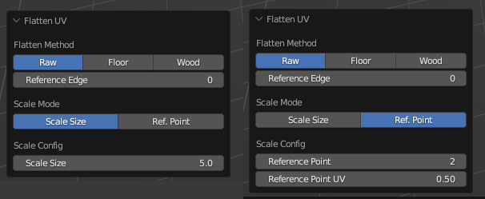
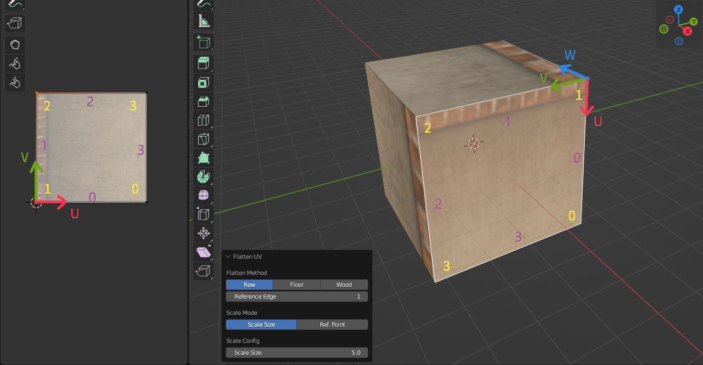
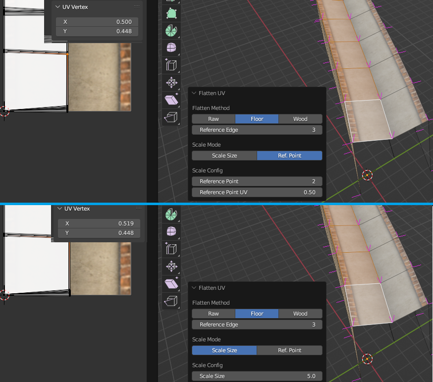
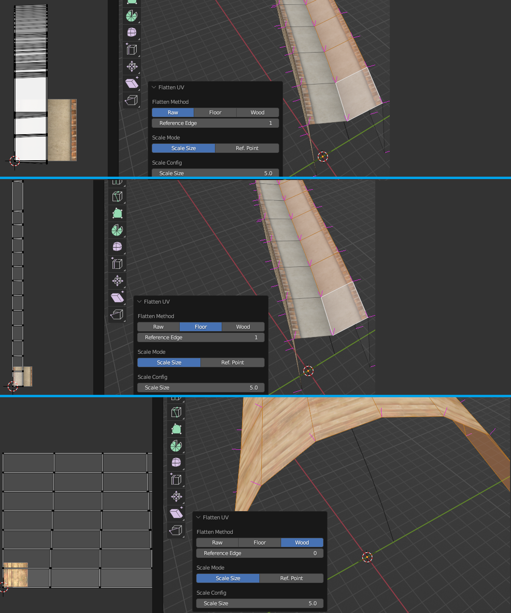

# UV贴图

## 钢轨贴图

3D视图中的菜单`Ballance - Rail UV`提供了给钢轨贴图的功能。

您需要先选择需要被贴图的钢轨（可以多选），然后再点击此菜单，即可开始进行钢轨贴图。然后你只需要选择钢轨所用的Material（材质）属性即可。此功能将清空选择物体的所有材质，并将各个面所用的材质全部指定为你所指定的材质。然后按照Ballance中对钢轨进行后处理的方式为你选中的物体设置其UV。因此，通过本操作的执行，可以使得钢轨具有和游戏内相同的外貌。

!!! info "钢轨UV其实并不重要"
    事实上，所有归入`Phys_FloorRails`组的物体均会在Ballance加载关卡时进行一个后处理。后处理方法的具体操作就是按照某个特定的映射函数重设这些物体的UV（Virtools中调用`TT_ReflectionMapping`）。所以钢轨的UV实际上并不重要，因为进入游戏后Ballance会为你统一设置，即使你不设置任何UV数据给钢轨，进入游戏后钢轨的样子都是正确的。

    因此，此功能通常应用于对那些不归入`Phys_FloorRails`组，但仍希望其能显示钢轨材质外观的物体的UV进行设置。又或者用于在Blender中渲染Ballance地图预览图等。

## 沿边沿贴图

沿边沿贴图是BBP插件的最重要的功能，最强大的功能，同时也是最难以理解的功能。它广泛应用于自定义结构或一行路面，木板的UV的设置。3D视图中的菜单`Ballance - Flatten UV`提供的就是沿边沿贴图功能。它只能在 **编辑模式** 下工作，因此你需要进入编辑模式（并同时进入面选择模式，因为沿边沿贴图是按面操作的）才能使用它。

沿边沿贴图通常与[选择循环面](https://docs.blender.org/manual/en/4.2/modeling/meshes/selecting/loops.html)，[选择最短路径](https://docs.blender.org/manual/en/4.2/modeling/meshes/selecting/linked.html#bpy-ops-mesh-shortest-path-select)等功能一起使用。你需要先选择一系列面，例如一系列连续的Ballance路面侧边，然后点击`Ballance - Flatten UV`开始进行沿边沿贴图。

沿边沿贴图的配置界面如下图所示，左侧是Scale Size（缩放数值）模式，右侧是Ref. Point（参考点）模式，我们稍后会说明这两个模式的区别。

沿边沿贴图顾名思义，其含义就是沿着某条边进行UV贴图。具体的操作就是利用线性代数的方法，使用过渡矩阵，将顶点的三维坐标转换到一个新的坐标系下。在这个新的坐标系中：

* 原点是Reference Edge（参考边）指定的序号的顶点，如下图所示。下图在UV和3D中用黄色字体标识了面的顶点序号，图中的Reference Edge为1，则当前面中顶点序号为1的顶点作为新坐标系的原点。
* Y轴（即V轴，XYZ对应UVW，后续不再注释）为Reference Edge指定的顶点到下一个顶点的连线，即顶点1到顶点2的边，也就是序号为1的边，如下图所示，下图UV和3D中用紫色字体标识了面的边序号。边1是以顶点1为起始点，顶点2为终点的一个向量。它有方向性，是向量，用作坐标轴时需要归一化。
* Z轴则是通过Reference Edge指定的边（在这里是边1）和其下一条相邻边（在这里是边2）做叉乘并归一化得出。如果发生三点共线，叉乘出零向量的情况，则会尝试使用面的法线数据取而代之。
* X轴由之前计算出的Y轴和Z轴做叉乘并归一化后得出。新坐标系下的XYZ仍然需要满足右手坐标系的要求。

建立完新坐标系并构建完过渡矩阵后并将每一个顶点都转换到新坐标系下后，我们便可丢弃Z分量，将XY映射到UV上，并同时将处于-U轴侧的顶点镜像到+U轴侧，这也是Flatten UV不支持凹多边形的原因。做镜像的原因是为了防止UV映射出错，例如上图中，路面侧边贴图的上沿花纹位于V轴，如果我们将上图中UV顶点沿V轴翻转（你可以试一试以加深理解），则会导致最终贴图显示不符合我们预期，即Reference Edge指定的边并不显示路面侧边花纹。

!!! info "Reference Edge的实指"
    Reference Edge实际上指代的就是那条需要被贴靠到V轴上的边的序号。又因为这条边具有方向性，同时也就决定了新坐标系中的原点。
    
    Flatten UV简单来说，就是让用户指定一条边，然后把它沿着UV的V轴贴上去。

在确定好坐标系后，我们还需要知道这个UV贴图需要展的多开，具体来说就是这个UV贴图的缩放数值应该是多少。对于V轴方向，由于Ballance的贴图特性（Ballance贴图总是沿着V轴延伸，以及Ballance中的3D的5等价于UV中的1），我们可以知道这个UV:3D的关系是1:5。而对于U轴方向则无法确定，这也就是Scale Mode属性的作用，让用户决定U轴方向上的缩放。

Scale Size（缩放数值）模式就是直接让用户指定这个缩放数值，例如默认值5代表着3D世界中的5等于UV世界中的1。Ref. Point（参考点）模式则允许用户指定面中某一个参考点的UV的U值，让插件自行推算其U轴上的缩放。例如我们将上图中的缩放数值模式切换成参考点模式，并指定Reference Point（参考点）为2，Reference Point UV（参考点UV）为1也可以贴上相同的贴图，我们来解释一下这里面的原理。首先Reference Point指定参考点，这个参考点是相对于Reference Edge指定的顶点，也就是参考系原点的偏移，因此在这里，Reference Edge为1，Reference Point为2，则实际上的参考点为顶点3。Reference Point UV指定了这个点的UV数值中U的数值为1，也就是可以看作强行把顶点3放置在了U轴为1的位置。BBP会根据这一点计算出对应的U轴缩放值，并应用到所有顶点上。

缩放数值模式通常用于路面侧边贴图，因为这些面具有固定的U轴缩放数值。而参考点模式通常用于那些无法确定缩放数值（通常是由于模型变形导致缩放数值在标准缩放数值范围附近波动）的贴图，例如由放样生成的凹路面的上表面，如下图所示。我们能肯定凹路面的中心的UV的U一定是0.5，但是不方便确定其缩放数值，因为难以计算，所以我们只需要使用参考点模式即可。下图的上半展示了参考点模式下的贴图结果，下半部分则是缩放数值模式，可以观察到在缩放数值模式下，凹路面中心的UV并不是精准的0.5，这会导致在显示上凹路面的中心不够黑。而参考点模式则精准地将凹路面中心的UV设置为0.5。

最后，Flatten Mode指定了展开模式。Raw表示完全不考虑面与面之间的联系，把每个面当作独立的内容来处理。Floor表示考虑V轴方向上相邻面的连续性，会尽可能将相邻的面使其在UV中也相邻，这样就可以避免在路面细分过多的情况下，使用Raw展开方式容易导致贴图在视觉上重复的问题。Floor展开方式常用在路面的贴图中，因此称为Floor。Wood与Floor类似，只是它不仅考虑V轴上的连续性，还会考虑U轴上的连续性，这通常用于凹木板，凸木板的贴图中，也是Wood的名称来源。

下图展示了三种不同展开模式的UV贴图分布。最上面是Raw展开模式，可以看到每个面的Reference Edge都被展开在了UV坐标原点的位置。中间是Floor展开模式，可以看到BBP将一系列连续的面沿着V轴方向展开了，而不是像Raw展开模式那样全部都堆在原点。最下方则是Wood展开模式，正在展开一个凸木板，可以看到在V轴和U轴上都考虑了面的连续性。

!!! info "Floor和Wood展开模式失败了"
    Floor和Wood相比Raw展开模式具有更多限制，它们只支持四边面，而且对建模的操作有很高要求，通常只有通过批量操作（例如细分，放样等）生成的几何结构才能被Floor和Wood正确识别。

    如果Floor和Wood展开模式失败了，且展开得到的贴图完全不可接受，请尝试使用更加规范地方式建模，或转为手动贴图。
