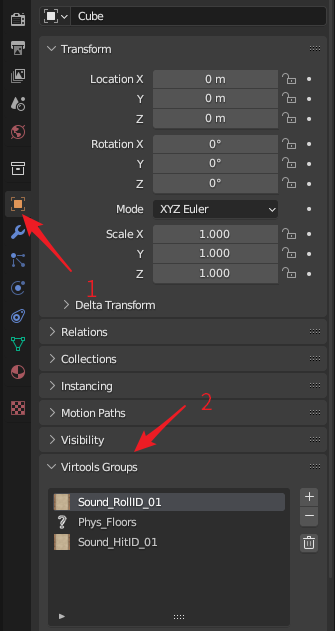
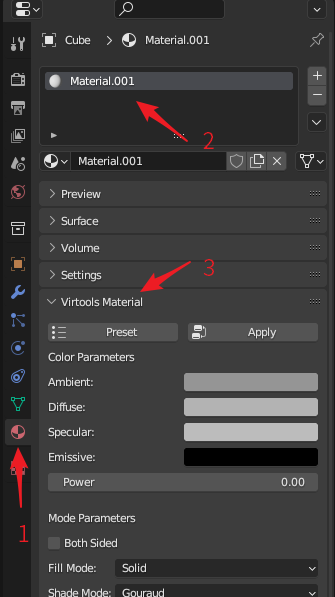
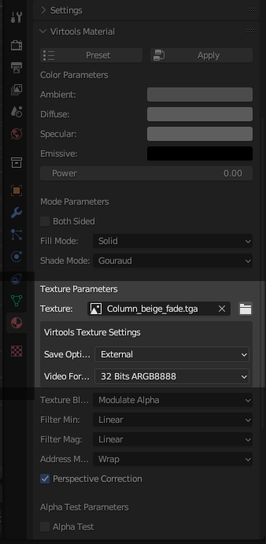
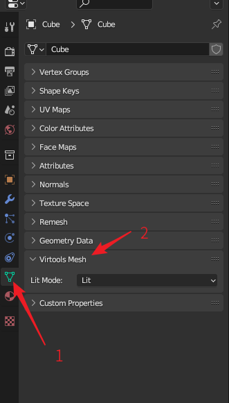

# Virtools属性

## Virtools组

BBP插件为每一个Blender物体添加了新的属性，被称为Virtools Group。与Virtools中的组具有相同的功能。选择一个物体，在`Object`属性面板可以找到`Virtools Group`面板。

在`Virtools Group`面板中，可以点击添加为物体归组。在点击添加按钮后，可以选择预定义，然后从所有合法的Ballance组名中选择一个添加。或选择自定义，然后输入你想要的组名添加。也可以点击删除按钮，删除选中的Virtools组。最后，可以通过点击垃圾桶按钮一次性删除这个物体的所有组数据（删除前会让你确认）。

BBP还在Blender的其它菜单提供了对Virtools组的访问，具体内容请参阅[按组操作](./group-operations.md)。

## Virtools材质

插件为每一个Blender材质添加了新的属性，被称为Virtools Material。它在Virtools材质与Blender材质之间架起沟通的桥梁。转到`Material`属性面板，选择一个材质，即可以找到`Virtools Material`面板。

可以在`Virtools Material`面板中设置材质属性，就像在Virtools中操作一般。`Virtools Material`面板中所有的材质参数均为Virtools中材质参数的映射，将准确地反映到最后保存的Virtools文档中。

`Virtools Material`面板提供了预设功能，点击顶部的`Preset`按钮即可开始进行预设。预设功能允许用户使用一些预设的材质设置，例如路面顶面，侧面的材质数据等，方便使用。需要注意的是，使用预设不会影响材质的贴图选项，当应用预设后，你仍然需要手动设置材质的贴图。

`Virtools Material`面板同样提供把`Virtools Material`面板中的材质数据转换到Blender材质上的功能，以在Blender中获得可视的效果。点击顶部的`Apply`按钮即可执行此功能。当你在Blender中保存Virtools文档时，Virtools文档中的材质数据将从`Virtools Material`面板中指定的数值获取，而不会从Blender材质中获取。这意味一个正确的材质设置过程是：先在`Virtools Material`面板中编辑材质参数，然后使用`Apply`按钮将其转换到Blender材质上，而不是直接去编辑Blender材质。

`Virtools Material`面板提供了材质修复功能，这个功能来源于[Ballance Virtools Plugin](https://github.com/yyc12345/BallanceVirtoolsHelper)。材质修复按钮位于`Preset`按钮和`Apply`按钮的右侧，是一个带有扳手图标的按钮。点击后需要再次确认才能使用，防止误操作。材质修复功能会根据当前材质引用的贴图文件的文件名判定它是哪一种类型的材质，再根据我们预设的修复设定（从游戏中获取）将其他参数修改得符合视觉要求。这通常用于一些游戏中看起来材质错误的物体的修复，例如发黑的Stopper等。

!!! info "还有一个全局材质修复功能"
    3D视图中，菜单`Ballance - Fix Material`与材质修复功能类似，但其会修复当前文档内所有材质。除非你确定当前文档内所有材质都需要修复，否则不要使用这个功能，因为它可能会将一些原本特殊设置的，正确的材质设置回你不想要的通用数值。

    全局材质修复功能点击后也需再次确认才能使用，以防止误操作。

`Virtools Material`面板中的Texture（贴图）属性不仅可以通过点击它来选择文档内的贴图，还可以通过点击右侧的文件夹按钮打开贴图文件浏览器，直接从文件系统中选择你想要的贴图（比从Shading菜单中选取更加快速）。文件浏览器默认位于Ballance的Texture目录下，以方便Ballance材质的选取。

## Virtools贴图

BBP插件为所有Blender贴图（实际上是Image）添加了新的属性，称为Virtools Texture。它在Virtools贴图与Blender图片之间架起联系。

与Blender材质不同的是，由于Blender的实现原因，贴图没有单独的属性面板，因此我们只能在`Virtools Material`面板中通过一种非直接的方式访问Virtools贴图属性。首先参照Virtools材质章节的说明找到`Virtools Material`面板，然后在`Virtools Material`面板中的材质插槽中选择一个贴图或打开一个贴图，就可以发现在材质的贴图属性下方额外显示了Virtools贴图属性，如下图高亮部分所示。

其中，Save Option表示贴图在Virtools中的存储方式，常见的存储方式有这几种：

* External：外部存储，文件只存储引用的文件名。所有Ballance原生贴图都应该使用此模式。
* Raw Data：原始数据，贴图存储在文件内，缺点是会导致文件很大。所有非原生Ballance贴图都应该使用此模式。
* Use Global：使用全局设定。除非是你正在修改一张已经存在地图，否则我们不建议使用此方式。我们建议在这里就明确指定各个贴图的存储方式，而不要使用全局值。全局设定在导出Virtools文档时被确定下来。

而Video Format表示贴图在Virtools中的渲染模式，常用的模式有这几种：

* 32 Bits ARGB8888：带有透明度的各类贴图的存储方式，例如柱子渐变部分。
* 16 Bits ARGB1555：不带有透明度的各类贴图的存储方式，例如路面。

## Virtools网格

BBP插件为所有Blender网格添加了新的属性，称为Virtools Mesh。转到`Data`属性面板，即可以找到`Virtools Mesh`面板。

Virtools网格目前只是作为兼容来使用的。其只有Lit Mode一个属性可以设置。多数早期地图由于不知道如何正确设置材质，导致路面发黑，所以经常将Lit Mode设置为Prelit以让路面正常显示。此属性是为了兼容这种设计而存在的，用户通常无需设置此选项。
